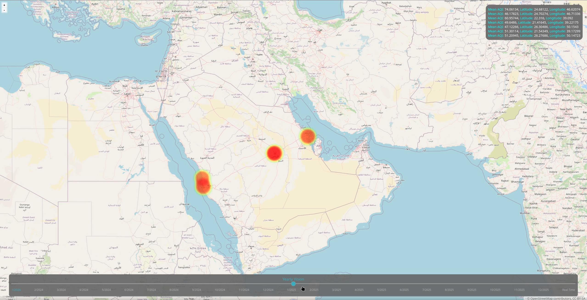

# Hi, I’m Jawad Kalthoom 👋 
### AI Engineer & Data Scientist 

I am a Computer Science graduate specializing in Artificial Intelligence from the University of Jeddah. I build machine learning systems for prediction, recommendation, and operational analytics using real-world datasets with millions of records.

---

## 📑 Certifications

* Data Science Nanodegree — Udacity — 2025
* Power BI Data Analysis Certificate — Udacity — 2025
* Google AI Essentials Certificate — Google — 2025

---

## 🚀 Featured Projects

### 📈 [Air Quality Visualization & Prediction](https://github.com/JKalthoom/Senior-Project-Air-Quality-AI) 

**Dataset size:** 11.3 million records  
**Objective:** Forecast air quality indicators using historical environmental data.  

**What I did:**
- Built a full preprocessing pipeline for large-scale time-series data
- Designed and trained a Bidirectional LSTM model using TensorFlow/Keras
- Tuned model architecture and hyperparameters to improve performance
- Evaluated model using RMSE and compared multiple architectures

**Result:**
Achieved RMSE of 0.7033 on validation data

**Tech stack:**
Python, TensorFlow, Pandas, NumPy, Matplotlib

### 💻 [Employee Performance Dashboard](https://github.com/JKalthoom/dsnd-dashboard-project)

**Objective:** Built an interactive dashboard to monitor employee performance and predict recruitment risk using historical event data.  

**What I did:**
- Designed a modular Python package for database access and reusable SQL queries
- Integrated a trained machine learning model to generate automated recruitment risk predictions
- Built an interactive dashboard using FastHTML and SQLite for real-time data visualization
- Implemented object-oriented architecture for scalable and maintainable code structure

**Tech stack:** Python, SQLite, Scikit-learn, Pandas, FastHTML, Matplotlib

### 🤖 [StyleSense Recommendation Engine](https://github.com/JKalthoom/dsnd-pipelines-project)
**Objective:** Built a machine learning model to predict whether customers would recommend a product using review text, customer demographics, and product features.

**What I did:**
- Preprocessed and cleaned textual and structured data using Pandas and spaCy
- Engineered NLP and demographic features to improve prediction quality
- Trained and evaluated classification models using Scikit-learn
- Performed hyperparameter tuning using HalvingRandomSearchCV to optimize performance
- Evaluated model using accuracy, precision, recall, and F1-score

**Tech stack:** Python, Scikit-learn, spaCy, Pandas, NumPy, Matplotlib, Seaborn

---

## 📊 Power BI dashboard

---

## 🛠️ Technical Toolbox
**Programming:** Python, SQL, Java, C, Git/GitHub, OOP, LaTeX.  
**AI & ML:** Deep Learning, NLP, Multi-Agent Systems, Predictive Modeling.  
**Data Engineering:** ETL Pipelines, Data Visualization (Matplotlib, Seaborn, Power BI).  

---

## 📬 Connect with Me
💼 [LinkedIn](https://linkedin.com/in/jawad-kalthoom)
📧 jkalthoom.ai@gmail.com
